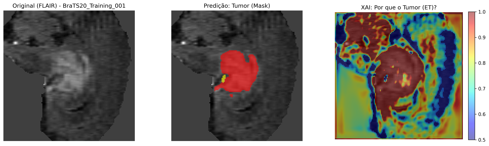

# NeuroSegment-BraTS-MONAI 🧠

[](https://monai.io/)
[](https://pytorch.org/)
[](#)

Repositório dedicado ao desenvolvimento de um pipeline de Deep Learning para a segmentação de tumores cerebrais utilizando o dataset **BraTS** (Brain Tumor Segmentation Challenge). O projeto aplica arquiteturas de estado da arte (como Swin UNETR e U-Net 3D) integradas ao framework **MONAI**.

## 👥 Alunos Envolvidos

Este projeto foi desenvolvido como parte da disciplina de Aprendizagem de Máquina na UFRPE por:

- **Beatriz Silva** (beatriz.pereiras@ufrpe.br)
- **Éverton da Silva** (everton.silvasouza@ufrpe.br)
- **Leonardo Viana** (leonardo.vianafilho@ufrpe.br)
- **Nicholas Camargo** (nicholas.camargo@ufrpe.br)

---

## 📂 Estrutura do Projeto

O repositório segue a organização de notebooks modulares exigida, mantendo a estrutura de dados local protegida por `.gitignore`.

```text
├── data/
│   ├── raw/            # Arquivos .nii.gz originais (necessário download manual)
│   └── processed/      # Dados processados e normalizados
├── notebooks/          # Fluxo completo do projeto (Notebooks 1 a 5)
├── models/             # Checkpoints dos modelos treinados (.pth)
├── .gitignore          # Filtro de arquivos pesados
└── requirements.txt    # Dependências do projeto
```

## 🚀 O Pipeline de Notebooks

O projeto está dividido em 5 etapas principais, conforme os requisitos da disciplina:

1. **01_Definicao.ipynb:** Contextualização do problema clínico e extração do dataset.
2. **02_Analise.ipynb:** Análise exploratória e descritiva dos volumes MRI (T1, T2, FLAIR).
3. **03_Metodologia.ipynb:** Preparação dos dados com MONAI (Transforms, Patch-based training) e arquitetura do modelo.
4. **04_Experimentos.ipynb:** Treinamento, validação e métricas de desempenho (Dice Score).
5. **05_Resultados.ipynb:** Explicabilidade (XAI), análise qualitativa e conclusões.

## 🛠️ Tecnologias e Frameworks

As principais ferramentas utilizadas no projeto incluem:

- **MONAI:** Para pré-processamento médico 3D e modelos de segmentação.
- **PyTorch:** Backend de Deep Learning.
- **Nibabel:** Manipulação de arquivos NIfTI (.nii.gz).
- **Optuna:** Busca de melhores hiperparâmetros para treinamento do modelo.
- **SHAP/Grad-CAM:** Técnicas de explicabilidade para auditoria do modelo.

## 🔧 Como Reproduzir Localmente

1. Clone o repositório:

```bash
git clone https://github.com/leovianaf/NeuroSegment-BraTS-MONAI.git
cd NeuroSegment-BraTS-MONAI
```

2. Crie e ative um ambiente virtual (recomendado):

```bash
python -m venv venv
source venv/bin/activate
```

3. Instale as dependências:

```bash
pip install -r requirements.txt
```

4. Organize os dados:
   - Baixe o dataset original do [BraTS](https://www.kaggle.com/datasets/awsaf49/brats20-dataset-training-validation/data) e posicione os diretórios em [`data/raw/`](./data/raw/) mantendo a hierarquia original do desafio.
   - Rode os notebooks de pré-processamento (ou use [`src/data_pipeline.py`](./src/data_pipeline.py)) para gerar `data/processed/`.

5. Execute os Notebooks:
   Abra os arquivos na pasta [`notebooks/`](./notebooks/) seguindo a ordem numérica.

## **Relatórios e Resultados**

- Artefatos gerados (plots, heatmaps, relatórios) ficam em [`reports/`](./reports/) organizados por técnica (`grad-cam/`, `shap/`).
- Inclui os checkpoints principais em [`models/`](./models/) (ex.: `best_metric_model_Unet_3D_v1.pth`).

## 📊 Metas de Sucesso

- Alcançar um Dice Score competitivo para as regiões de tumor (WT, TC, ET).
- Demonstrar a explicabilidade do modelo, confirmando que a rede foca nas áreas anatômicas corretas.

## 📊 Resultados Finais

O desempenho médio dos modelos no conjunto de validação (BraTS 2020) foi:

| Modelo        | Dice Médio | HD95 (mm) | Sensibilidade |
| :------------ | :--------: | :-------: | :-----------: |
| **SegResNet** | **0.8187** | **5.04**  |  **0.8626**   |
| U-Net 3D      |   0.8100   |   5.51    |    0.8591     |
| Swin UNETR    |   0.8001   |   8.88    |    0.8463     |

> A **SegResNet** destacou-se pela maior precisão de borda (menor HD95), sendo o modelo escolhido para as análises de explicabilidade mais profundas.

### Visualização de Resultados (XAI)


_Exemplo de segmentação e mapa de ativação Grad-CAM evidenciando o foco do modelo no tumor ativo (ET)._

---
